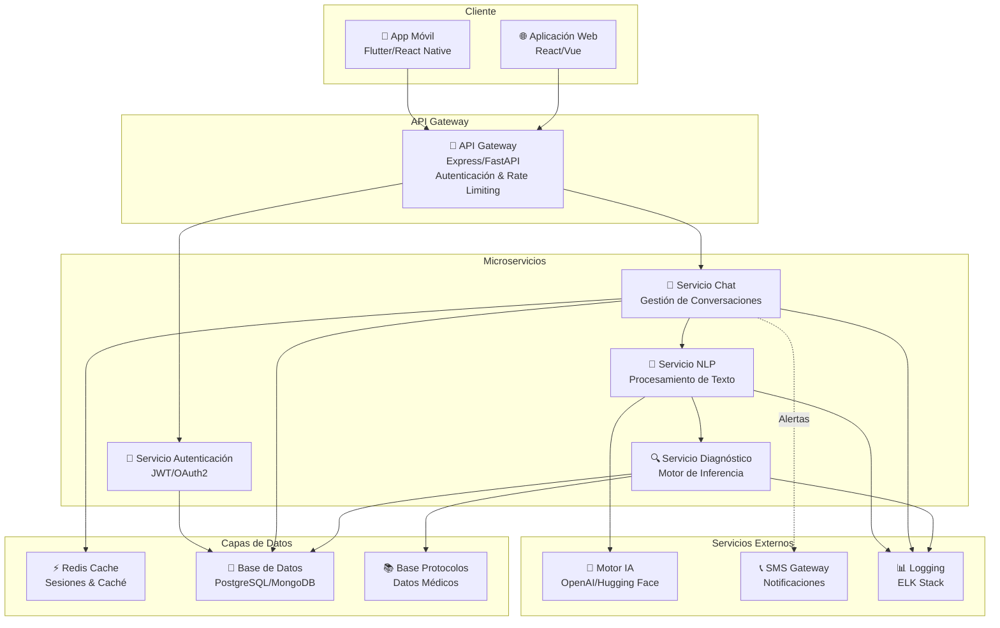
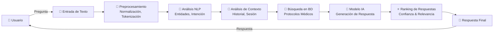
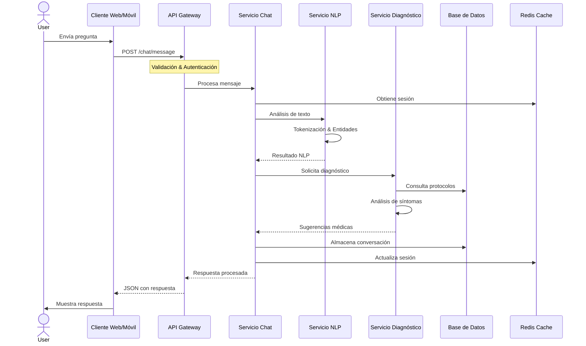

# Chatbot Militar de Primeros Auxilios 🏥⚕️

Sistema inteligente de asistencia médica para contextos militares, basado en inteligencia artificial y procesamiento de lenguaje natural para proporcionar guía de primeros auxilios en tiempo real.

## 📋 Tabla de Contenidos

- [Descripción](#descripción)
- [Características](#características)
- [Arquitectura del Sistema](#arquitectura-del-sistema)
- [Componentes Principales](#componentes-principales)
- [Flujo de Datos](#flujo-de-datos)
- [Flujo de Respuestas](#flujo-de-respuestas)
- [Stack Tecnológico](#stack-tecnológico)
- [Instalación](#instalación)
- [Uso](#uso)
- [Contribución](#contribución)
- [Licencia](#licencia)

---

## 📝 Descripción

Este proyecto implementa un chatbot conversacional especializado en primeros auxilios militares, capaz de:

- **Diagnosticar síntomas** mediante análisis de lenguaje natural
- **Proporcionar orientación médica** según protocolos establecidos
- **Sugerir procedimientos de emergencia** adaptados a contextos operacionales
- **Mantener conversaciones contextuales** con seguimiento de historiales

---

## ✨ Características

✅ Procesamiento de lenguaje natural (NLP)  
✅ Módulo de inteligencia artificial para diagnósticos  
✅ Base de datos de protocolos médicos militares  
✅ Interfaz conversacional en tiempo real  
✅ Integración con APIs médicas  
✅ Almacenamiento seguro de sesiones  
✅ Logs y auditoría completa  

---

## 🏗️ Arquitectura del Sistema



---

## 🔧 Componentes Principales

### 1. **Cliente (Frontend)**
- **Aplicación Web**: Interfaz responsiva para navegadores
- **Aplicación Móvil**: Cliente nativo para iOS/Android

### 2. **API Gateway**
- Punto de entrada único para todas las solicitudes
- Autenticación y autorización centralizada
- Rate limiting y protección DDoS
- Enrutamiento inteligente hacia microservicios

### 3. **Microservicios**

#### 💬 Servicio Chat
- Gestión de sesiones de conversación
- Historial de mensajes
- Contexto conversacional persistente

#### 🧠 Servicio NLP
- Procesamiento de lenguaje natural
- Tokenización y análisis sintáctico
- Extracción de entidades médicas
- Análisis de sentimientos

#### 🔍 Servicio Diagnóstico
- Motor de reglas basado en síntomas
- Integración con modelos de IA
- Base de protocolos médicos militares
- Sugerencias terapéuticas

#### 🔑 Servicio Autenticación
- Gestión de usuarios y permisos
- JWT y OAuth2
- Control de acceso basado en roles (RBAC)

### 4. **Capas de Datos**
- **Redis**: Caché distribuido y sesiones
- **PostgreSQL/MongoDB**: Base de datos principal
- **Base de Protocolos**: Información médica estructurada

### 5. **Servicios Externos**
- **Motor de IA**: Generación de respuestas avanzadas
- **SMS Gateway**: Notificaciones de emergencia
- **ELK Stack**: Logging centralizado

---

## 📊 Flujo de Datos



---

## 🔄 Flujo de Respuestas



---

## 💻 Stack Tecnológico

### Backend
- **Runtime**: Node.js / Python 3.9+
- **Framework**: Express.js / FastAPI
- **Base de Datos**: PostgreSQL 12+ / MongoDB
- **Caché**: Redis 6+
- **IA/ML**: TensorFlow, PyTorch, Transformers

### Frontend
- **Framework Web**: React 18+ / Vue 3+
- **Framework Móvil**: Flutter / React Native
- **Styling**: Tailwind CSS / Material-UI
- **State Management**: Redux / Vuex

### DevOps & Infraestructura
- **Containerización**: Docker
- **Orquestación**: Kubernetes / Docker Compose
- **CI/CD**: GitHub Actions / GitLab CI
- **Logging**: ELK Stack (Elasticsearch, Logstash, Kibana)
- **Monitoreo**: Prometheus + Grafana

### Seguridad
- **Autenticación**: JWT, OAuth2, 2FA
- **Encriptación**: TLS/SSL, AES-256
- **OWASP**: Implementación de mejores prácticas

---

## 🚀 Instalación

### Requisitos Previos
- Node.js v16+
- Python 3.9+
- Docker & Docker Compose
- Git

### Pasos de Instalación

1. **Clonar el repositorio**
```bash
git clone https://github.com/jair20-ar/chat-bot-militar-de-primeros-auxilios-.git
cd chat-bot-militar-de-primeros-auxilios-
```

2. **Configurar variables de entorno**
```bash
cp .env.example .env
# Editar .env con tus credenciales
```

3. **Instalar dependencias**
```bash
# Backend
cd chatbot-militar/backend
npm install

# Frontend
cd ../frontend
npm install
```

4. **Iniciar servicios con Docker**
```bash
docker-compose up -d
```

5. **Ejecutar migraciones de BD**
```bash
npm run migrate
```

6. **Iniciar aplicación**
```bash
npm start
```

---

## 📖 Uso

### API REST Básica

**Enviar mensaje**
```bash
curl -X POST http://localhost:3000/api/chat/message \
  -H "Content-Type: application/json" \
  -H "Authorization: Bearer YOUR_TOKEN" \
  -d '{
    "message": "Me duele la cabeza y tengo fiebre",
    "session_id": "user-12345"
  }'
```

**Obtener historial de sesión**
```bash
curl -X GET http://localhost:3000/api/chat/history/user-12345 \
  -H "Authorization: Bearer YOUR_TOKEN"
```

---

## 🤝 Contribución

¡Tus contribuciones son bienvenidas! Por favor:

1. Fork el proyecto
2. Crea una rama con tu feature (`git checkout -b feature/AmazingFeature`)
3. Commit tus cambios (`git commit -m 'Add AmazingFeature'`)
4. Push a la rama (`git push origin feature/AmazingFeature`)
5. Abre un Pull Request

Consulta [CONTRIBUTING.md](CONTRIBUTING.md) para más detalles.

---

## 📜 Licencia

Este proyecto está licenciado bajo la Licencia MIT - ver [LICENSE](LICENSE) para más detalles.

---

## 📞 Contacto

- **Autor**: Jair Rodríguez
- **Email**: jair20.ar@example.com
- **GitHub**: [@jair20-ar](https://github.com/jair20-ar)

---

## 🙏 Agradecimientos

- Equipo de desarrollo militar
- Consultores médicos especializados
- Comunidad de código abierto

---

**Última actualización**: 30 de Mayo, 2026  
**Versión**: 1.0.0
