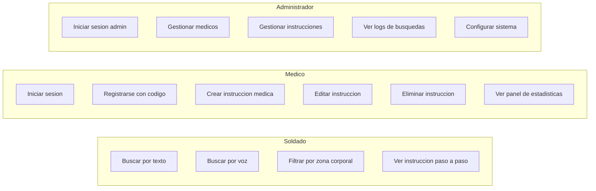
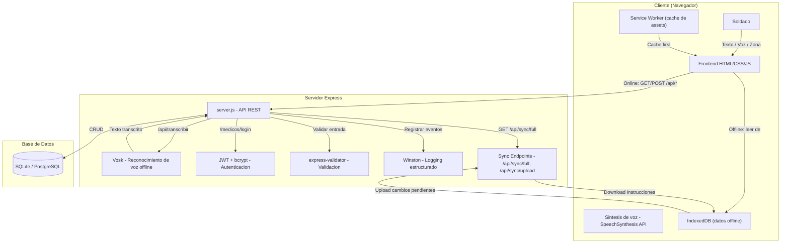

# X-60 — Sistema de Instrucciones Médicas Tácticas

Chatbot web offline-first para primeros auxilios en contexto militar. Permite a soldados buscar instrucciones médicas por voz o gestos táctiles, y a médicos registrar protocolos de emergencia paso a paso. Funciona 100% sin internet gracias a reconocimiento de voz local (Vosk) y almacenamiento offline (IndexedDB + Service Worker).

El nombre **X-60** hace referencia a los **60 minutos dorados** de la medicina táctica — la ventana de tiempo crítica que tiene un herido en campo de batalla para recibir atención médica y sobrevivir.

---

## Diagrama de Casos de Uso


```mermaid
flowchart LR
    subgraph Soldado["Soldado"]
        S1[Buscar por texto]
        S2[Buscar por voz]
        S3[Filtrar por zona corporal]
        S4[Ver instruccion paso a paso]
    end

    subgraph Medico["Medico"]
        M1[Iniciar sesion]
        M2[Registrarse con codigo]
        M3[Crear instruccion medica]
        M4[Editar instruccion]
        M5[Eliminar instruccion]
        M6[Ver panel de estadisticas]
    end

    subgraph Admin["Administrador"]
        A1[Iniciar sesion admin]
        A2[Gestionar medicos]
        A3[Gestionar instrucciones]
        A4[Ver logs de busquedas]
        A5[Configurar sistema]
    end
```

## Diagrama de Flujo del Sistema


```mermaid
flowchart TD
    subgraph Cliente["Cliente (Navegador)"]
        S["Soldado"]
        F["Frontend HTML/CSS/JS"]
        TTS["Sintesis de voz - SpeechSynthesis API"]
        IDB["IndexedDB (datos offline)"]
        SW["Service Worker (cache de assets)"]
    end

    subgraph Servidor["Servidor Express"]
        API["server.js - API REST"]
        VK["Vosk - Reconocimiento de voz offline"]
        AUTH["JWT + bcrypt - Autenticacion"]
        VAL["express-validator - Validacion"]
        LOG["Winston - Logging estructurado"]
        SYNC["Sync Endpoints - /api/sync/full, /api/sync/upload"]
    end

    subgraph BD["Base de Datos"]
        DB[(SQLite / PostgreSQL)]
    end

    S -->|Texto / Voz / Zona| F
    F -->|Online: GET/POST /api/*| API
    F -->|Offline: leer de| IDB
    SW -->|Cache first| F
    API -->|/api/transcribir| VK
    VK -->|Texto transcrito| API
    API -->|/medicos/login| AUTH
    API -->|Validar entrada| VAL
    API -->|Registrar eventos| LOG
    API <-->|CRUD| DB
    API -->|GET /api/sync/full| SYNC
    SYNC -->|Download instrucciones| IDB
    IDB -->|Upload cambios pendientes| SYNC
```

---

## Caracteristicas

- **Offline-first** — Service Worker cachea assets, IndexedDB almacena datos localmente, sincronizacion automatica cuando hay red
- **Reconocimiento de voz offline** — Vosk (modelo espanol ~50MB) sin dependencia de internet
- **Selector anatomico** — Filtro por zona del cuerpo (cabeza, torax, abdomen, extremidades, etc.)
- **Reproduccion de instrucciones** — Paso a paso con sintesis de voz (SpeechSynthesis) y avance automatico
- **Roles de usuario** — Soldado (sin autenticacion), Medico (registro con codigo), Administrador
- **Panel medico** — Creacion, edicion y eliminacion de instrucciones medicas
- **Panel administrador** — Gestion de medicos, instrucciones y registro de busquedas
- **Reconocimiento de gestos** — Navegacion tactil con dibujo de gestos en pantalla
- **PWA instalable** — Se puede instalar en la pantalla de inicio del tablet
- **Seguridad por capas** — JWT, bcrypt, rate limiting, helmet, sanitizacion XSS, correlation ID

---

## Stack Tecnologico

### Backend
| Tecnologia | Uso |
|---|---|
| **Node.js 18 + Express** | Servidor HTTP monolitico |
| **SQLite3** / **PostgreSQL** | Base de datos (SQLite local, PostgreSQL en produccion) |
| **Vosk** (modelo pequeno espanol) | Reconocimiento de voz offline |
| **ffmpeg** | Conversion de audio a WAV |
| **jsonwebtoken** + **bcryptjs** | Autenticacion y hash de contrasenas |
| **helmet** + **cors** + **express-rate-limit** | Seguridad HTTP |
| **express-validator** | Validacion de entrada + sanitizacion XSS |
| **winston** | Logging estructurado JSON con correlation ID |
| **multer** | Subida de archivos (audio) |

### Frontend
| Tecnologia | Uso |
|---|---|
| **HTML + CSS + JavaScript vanilla** | Sin frameworks ni build steps |
| **IndexedDB** (db-local.js) | Almacenamiento offline de instrucciones |
| **Service Worker** (sw.js) | Cache de assets para funcionar sin red |
| **Web App Manifest** (manifest.json) | PWA instalable |
| **SpeechSynthesis API** | Sintesis de voz en instrucciones |
| **SpeechRecognition API** | Busqueda por voz en el navegador |
| **Canvas API** | Sistema de gestos tactiles |

### Infraestructura
| Tecnologia | Uso |
|---|---|
| **Docker + Docker Compose** | Contenedorizacion y orquestacion |
| **GitHub Actions** | CI/CD (lint + tests automaticos) |
| **Jest + Supertest** | 58 pruebas automatizadas |
| **Render** | Despliegue en produccion con health check |

---

## Estructura del Proyecto

```
proyecto b/
├── .github/workflows/ci.yml    # Pipeline CI/CD
├── .gitignore
├── .env.example
├── CONTRIBUTING.md              # Reglas de ramas y commits
├── CHANGELOG.md
├── README.md
├── chatbot-militar/
│   ├── Dockerfile               # Artefacto inmutable
│   ├── docker-compose.yml       # Backend + PostgreSQL
│   ├── RUNBOOK.md               # Protocolo L1/L2/L3
│   ├── backend/
│   │   ├── server.js            # API REST (17+ endpoints)
│   │   ├── db.js                # Conexion SQLite / PostgreSQL
│   │   ├── seed.js              # Semilla de base de datos
│   │   ├── middleware/
│   │   │   ├── auth.js          # JWT sign/verify + requireAdmin
│   │   │   ├── validate.js      # express-validator + sanitizacion
│   │   │   ├── logger.js        # Winston logger JSON
│   │   │   └── correlation.js   # Correlation ID por request
│   │   ├── __tests__/           # 58 pruebas automatizadas
│   │   ├── model/               # Modelo Vosk de reconocimiento de voz
│   │   └── logs/                # Logs generados por Winston
│   ├── frontend/
│   │   ├── html/                # 10 paginas HTML
│   │   ├── styles/              # CSS por pagina + temas
│   │   ├── js/
│   │   │   ├── api.js           # fetchOfflineFirst()
│   │   │   ├── db-local.js      # IndexedDB wrapper
│   │   │   ├── sync.js          # Motor de sincronizacion
│   │   │   └── ...              # JS por pagina
│   │   ├── sw.js                # Service Worker
│   │   ├── manifest.json        # PWA manifest
│   │   └── imagenes/
```

---

## Roles de Usuario

| Rol | Acceso |
|---|---|
| **Soldado** | Sin autenticacion. Busca instrucciones, filtra por zona corporal, reproduce pasos con voz. |
| **Medico** | Se registra con codigo (`31150106` por defecto). Crea, edita y elimina sus propias instrucciones. |
| **Administrador** | Login con contrasena (`UNEFA2026` por defecto). Gestiona medicos, instrucciones, codigo de registro y logs de busqueda. |

---

## Instalacion

### Opcion 1: Docker (Recomendado)

```bash
# 1. Clonar
git clone https://github.com/jair20-ar/chat-bot-militar-de-primeros-auxilios-.git
cd chat-bot-militar-de-primeros-auxilios-

# 2. Levantar con Docker Compose
cd chatbot-militar
docker-compose up -d

# 3. Verificar
curl http://localhost:3001/api/health
# -> {"status":"ok"}

# 4. Abrir en el navegador
# http://localhost:3001
```

### Opcion 2: Manual

```bash
# 1. Clonar
git clone https://github.com/jair20-ar/chat-bot-militar-de-primeros-auxilios-.git
cd chat-bot-militar-de-primeros-auxilios-

# 2. Instalar dependencias del backend
cd chatbot-militar/backend
npm install

# 3. Iniciar servidor
npm start

# 4. Abrir en el navegador
# http://localhost:3001
```

> El servidor usa SQLite por defecto. En produccion (Render) usa PostgreSQL via la variable `DATABASE_URL`.

### Modo Offline / PWA

Una vez que el navegador carga la app por segunda vez, el Service Worker cachea todos los assets estaticos. Despues, la app funciona sin internet:

1. **Primera vez con internet** — La tablet descarga todas las instrucciones del servidor y las guarda en IndexedDB
2. **Sin internet** — Todas las busquedas y visualizaciones se hacen desde datos locales
3. **Cuando vuelve la red** — Los cambios pendientes se suben automaticamente al servidor

Para instalar como PWA en Android: Chrome muestra "Agregar a pantalla de inicio". En Windows: Edge/Chrome muestra "Instalar aplicacion".

---

## API

### Autenticacion
| Metodo | Endpoint | Descripcion |
|---|---|---|
| `POST` | `/medicos/registro` | Registro de medico (requiere `codigo_registro`) |
| `POST` | `/medicos/login` | Login de medico, devuelve JWT |
| `POST` | `/api/admin/login` | Login de administrador, devuelve JWT |

### Instrucciones medicas
| Metodo | Endpoint | Auth | Descripcion |
|---|---|---|---|
| `GET` | `/api/instrucciones` | — | Listar todas las instrucciones |
| `GET` | `/api/instrucciones/:id` | — | Obtener instruccion por ID |
| `POST` | `/api/instrucciones` | JWT medico | Crear instruccion |
| `PUT` | `/api/instrucciones/:id` | JWT medico | Actualizar instruccion |
| `DELETE` | `/api/instrucciones/:id` | JWT medico | Eliminar instruccion |

### Transcripcion de voz
| Metodo | Endpoint | Descripcion |
|---|---|---|
| `POST` | `/api/transcribir` | Sube audio (webm/wav/mp3), devuelve texto transcrito via Vosk |

### Sincronizacion offline
| Metodo | Endpoint | Descripcion |
|---|---|---|
| `GET` | `/api/sync/full` | Descarga completa de instrucciones para sync offline |
| `POST` | `/api/sync/upload` | Sube cambios pendientes desde tablets offline |

### Administracion
| Metodo | Endpoint | Auth | Descripcion |
|---|---|---|---|
| `GET` | `/api/admin/medicos` | JWT admin | Listar medicos |
| `DELETE` | `/api/admin/medicos/:id` | JWT admin | Eliminar medico y sus instrucciones |
| `GET` | `/api/admin/config` | JWT admin | Obtener configuracion y estadisticas |
| `POST` | `/api/admin/config` | JWT admin | Actualizar configuracion |
| `GET` | `/api/admin/busquedas` | JWT admin | Log de busquedas (filtro por periodo) |

### Logging de busquedas
| Metodo | Endpoint | Descripcion |
|---|---|---|
| `POST` | `/api/log-busqueda` | Registra cuando un soldado ve una instruccion |

### Health Check
```bash
curl http://localhost:3001/api/health
# -> { "status": "ok" }
```

---

## Testing

```bash
cd chatbot-militar/backend
npm test
# 58 tests passing (api, auth, validate, correlation, logger)
```

---

## Despliegue en Render

El proyecto incluye `render.yaml` con la configuracion:

- **Runtime**: Node 18.19.0
- **Root directory**: `chatbot-militar/backend`
- **Start command**: `node --max-old-space-size=180 server.js`
- **Base de datos**: PostgreSQL (plan free)
- **Health check**: `GET /api/health`
- **Auto-deploy**: Push a rama main despliega automaticamente

---

## CI/CD

GitHub Actions ejecuta automaticamente en cada push/PR a main:

1. **Checkout** del repositorio
2. **Setup** Node.js 18.19.0
3. **Install** dependencias (`npm ci`)
4. **Lint** (`npm run lint`)
5. **Tests** (`npm test` — 58 pruebas)

Ver `.github/workflows/ci.yml`.

---

## Contribuir

Ver [CONTRIBUTING.md](CONTRIBUTING.md) para reglas de ramas (GitFlow), Conventional Commits y proceso de Pull Request.

---

## Licencia

ISC

---

## Autores

- **Jair Molleda** & **Mariangel Chirinos**
- Email: jaircolina@gmail.com
- GitHub: [@jair20-ar](https://github.com/jair20-ar)

---

## Mas Informacion

- [Guia de contribucion](CONTRIBUTING.md)
- [Registro de cambios](CHANGELOG.md)
- [RUNBOOK operativo](chatbot-militar/RUNBOOK.md)
