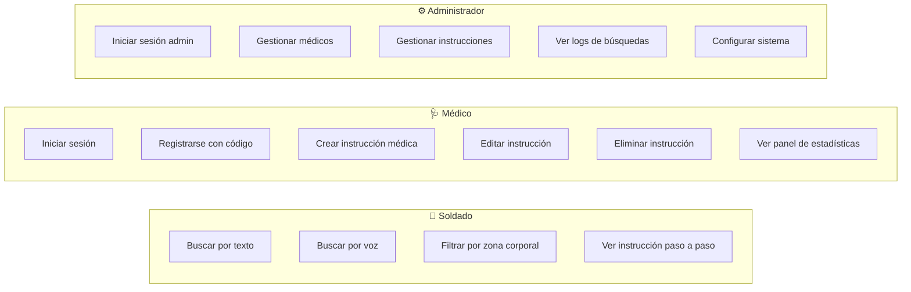
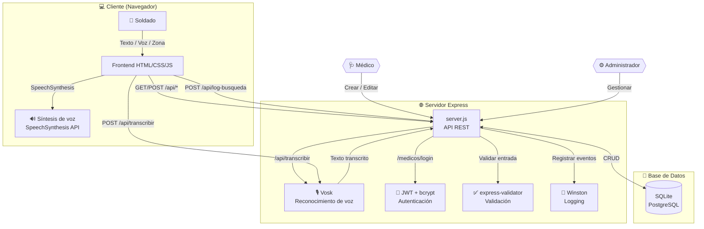

# Sistema de Asistencia Médica Táctica (TACMED FANB)

Chatbot web para primeros auxilios en contexto militar. Permite a soldados buscar instrucciones médicas por texto o voz, y a médicos registrar protocolos de emergencia.

---

## 📊 Diagrama de Casos de Uso


```mermaid
flowchart LR
    subgraph Soldado["💂 Soldado"]
        S1[Buscar por texto]
        S2[Buscar por voz]
        S3[Filtrar por zona corporal]
        S4[Ver instrucción paso a paso]
    end

    subgraph Medico["🩺 Médico"]
        M1[Iniciar sesión]
        M2[Registrarse con código]
        M3[Crear instrucción médica]
        M4[Editar instrucción]
        M5[Eliminar instrucción]
        M6[Ver panel de estadísticas]
    end

    subgraph Admin["⚙️ Administrador"]
        A1[Iniciar sesión admin]
        A2[Gestionar médicos]
        A3[Gestionar instrucciones]
        A4[Ver logs de búsquedas]
        A5[Configurar sistema]
    end
```

## 🔄 Diagrama de Flujo del Sistema


```mermaid
flowchart TD
    subgraph Cliente["💻 Cliente (Navegador)"]
        S[💂 Soldado]
        F[Frontend HTML/CSS/JS]
        TTS[🔊 Síntesis de voz<br/>SpeechSynthesis API]
    end

    subgraph Servidor["🌐 Servidor Express"]
        API[server.js<br/>API REST]
        VK[🎙️ Vosk<br/>Reconocimiento de voz]
        AUTH[🔐 JWT + bcrypt<br/>Autenticación]
        VAL[✅ express-validator<br/>Validación]
        LOG[📝 Winston<br/>Logging]
    end

    subgraph BD["💾 Base de Datos"]
        DB[(SQLite<br/>PostgreSQL)]
    end

    S -->|Texto / Voz / Zona| F
    F -->|GET/POST /api/*| API
    API -->|/api/transcribir| VK
    VK -->|Texto transcrito| API
    API -->|/medicos/login| AUTH
    API -->|Validar entrada| VAL
    API -->|Registrar eventos| LOG
    API <-->|CRUD| DB

    F -->|POST /api/log-busqueda| API
    F -->|POST /api/transcribir| VK
    F -->|SpeechSynthesis| TTS

    M{{🩺 Médico}} -->|Crear / Editar| API
    A{{⚙️ Administrador}} -->|Gestionar| API
```

---

## ✨ Características

- **Búsqueda por texto y voz** — Transcripción offline con Vosk (modelo español)
- **Selector anatómico** — Filtro por zona del cuerpo (cabeza, tórax, abdomen, extremidades, etc.)
- **Reproducción de instrucciones** — Paso a paso con síntesis de voz (`SpeechSynthesis`) y avance automático
- **Roles de usuario** — Soldado (sin autenticación), Médico (registro con código), Administrador
- **Panel médico** — Creación, edición y eliminación de instrucciones médicas
- **Panel administrador** — Gestión de médicos, instrucciones y registro de búsquedas
- **Reconocimiento de gestos** — Navegación táctil con dibujo de gestos en pantalla
- **Tema claro/oscuro** — Alternancia con persistencia en `localStorage`

---

## 💻 Stack Tecnológico

### Backend
| Tecnología | Uso |
|---|---|
| **Node.js 18 + Express** | Servidor HTTP monolítico |
| **SQLite3** / **PostgreSQL** | Base de datos (SQLite local, PostgreSQL en producción) |
| **Vosk** (modelo pequeño español) | Reconocimiento de voz offline |
| **ffmpeg** | Conversión de audio a WAV |
| **jsonwebtoken** + **bcryptjs** | Autenticación y hash de contraseñas |
| **helmet** + **cors** + **express-rate-limit** | Seguridad HTTP |
| **express-validator** | Validación de entrada |
| **winston** | Logging estructurado |
| **multer** | Subida de archivos (audio) |

### Frontend
| Tecnología | Uso |
|---|---|
| **HTML + CSS + JavaScript vanilla** | Sin frameworks ni build steps |
| **SpeechSynthesis API** | Síntesis de voz en instrucciones |
| **MediaRecorder API** | Grabación de audio para búsqueda por voz |
| **Canvas API** | Sistema de gestos táctiles |

---

## 🗂️ Estructura del Proyecto

```
proyecto b/
├── chatbot-militar/
│   ├── backend/
│   │   ├── server.js              # Servidor Express (API + archivos estáticos)
│   │   ├── db.js                  # Conexión SQLite / PostgreSQL
│   │   ├── seed.js                # Semilla de base de datos
│   │   ├── middleware/
│   │   │   ├── auth.js            # JWT sign/verify + requireAdmin
│   │   │   ├── validate.js        # Cadenas de validación express-validator
│   │   │   ├── logger.js          # Winston logger
│   │   │   └── correlation.js     # Correlation ID por request
│   │   ├── model/                 # Modelo Vosk de reconocimiento de voz
│   │   └── logs/                  # Logs generados por Winston
│   ├── frontend/
│   │   ├── html/                  # 10 páginas HTML (index, buscador, admin, etc.)
│   │   ├── styles/                # CSS por página + temas
│   │   ├── js/                    # JS por página + utilidades
│   │   └── imagenes/              # Escudo FANB, anatomía, etc.
├── render.yaml                    # Configuración de despliegue en Render
├── package.json                   # Script raíz (start, dev)
├── CHANGELOG.md
├── CONTRIBUTING.md
└── README.md
```

---

## 👥 Roles de Usuario

| Rol | Acceso |
|---|---|
| **Soldado** | Sin autenticación. Busca instrucciones, filtra por zona corporal, reproduce pasos con voz. |
| **Médico** | Se registra con código (`FANB2026` por defecto). Crea, edita y elimina sus propias instrucciones. |
| **Administrador** | Login con contraseña (`UNEFA2026` por defecto). Gestiona médicos, instrucciones, código de registro y logs de búsqueda. |

---

## 🚀 Instalación y Uso Local

### Requisitos
- Node.js 18.19.0

### Pasos

```bash
# 1. Clonar
git clone https://github.com/jair20-ar/chat-bot-militar-de-primeros-auxilios-.git
cd chat-bot-militar-de-primeros-auxilios-

# 2. Instalar dependencias del backend
cd chatbot-militar/backend
npm install

# 3. Iniciar servidor
npm start

# 4. Abrir en el navegador
# http://localhost:3001
```

> El servidor usa SQLite por defecto. En producción (Render) usa PostgreSQL vía la variable `DATABASE_URL`.

---

## 📡 API

### Autenticación
| Método | Endpoint | Descripción |
|---|---|---|
| `POST` | `/medicos/registro` | Registro de médico (requiere `codigo_registro`) |
| `POST` | `/medicos/login` | Login de médico, devuelve JWT |
| `POST` | `/api/admin/login` | Login de administrador, devuelve JWT |

### Instrucciones médicas
| Método | Endpoint | Auth | Descripción |
|---|---|---|---|
| `GET` | `/api/instrucciones` | — | Listar todas las instrucciones |
| `GET` | `/api/instrucciones/:id` | — | Obtener instrucción por ID |
| `POST` | `/api/instrucciones` | JWT médico | Crear instrucción |
| `PUT` | `/api/instrucciones/:id` | JWT médico | Actualizar instrucción |
| `DELETE` | `/api/instrucciones/:id` | JWT médico | Eliminar instrucción |

### Transcripción de voz
| Método | Endpoint | Descripción |
|---|---|---|
| `POST` | `/api/transcribir` | Sube audio (webm), devuelve texto transcrito vía Vosk |

### Administración
| Método | Endpoint | Auth | Descripción |
|---|---|---|---|
| `GET` | `/api/admin/medicos` | JWT admin | Listar médicos |
| `DELETE` | `/api/admin/medicos/:id` | JWT admin | Eliminar médico y sus instrucciones |
| `GET` | `/api/admin/config` | JWT admin | Obtener configuración y estadísticas |
| `POST` | `/api/admin/config` | JWT admin | Actualizar configuración |
| `GET` | `/api/admin/busquedas` | JWT admin | Log de búsquedas (filtro por período) |

### Logging de búsquedas
| Método | Endpoint | Descripción |
|---|---|---|
| `POST` | `/api/log-busqueda` | Registra cuando un soldado ve una instrucción |

### Health Check
```bash
curl http://localhost:3001/api/health
# → { "status": "ok" }
```

---

## 🌐 Despliegue en Render

El proyecto incluye `render.yaml` con la configuración:

- **Runtime**: Node 18.19.0
- **Root directory**: `chatbot-militar/backend`
- **Start command**: `node --max-old-space-size=180 server.js`
- **Base de datos**: PostgreSQL (plan free)
- **Health check**: `GET /api/health`

---

## 📄 Licencia

ISC

---

## 👨‍💻 Autores

- **Jair Molleda** & **Mariangel Chirinos**
- Email: jaircolina@gmail.com
- GitHub: [@jair20-ar](https://github.com/jair20-ar)

---

## 📚 Más Información

- [Guía de contribución](CONTRIBUTING.md)
- [Registro de cambios](CHANGELOG.md)
- [RUNBOOK operativo](chatbot-militar/backend/RUNBOOK.md)
